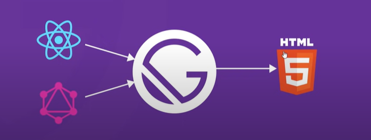
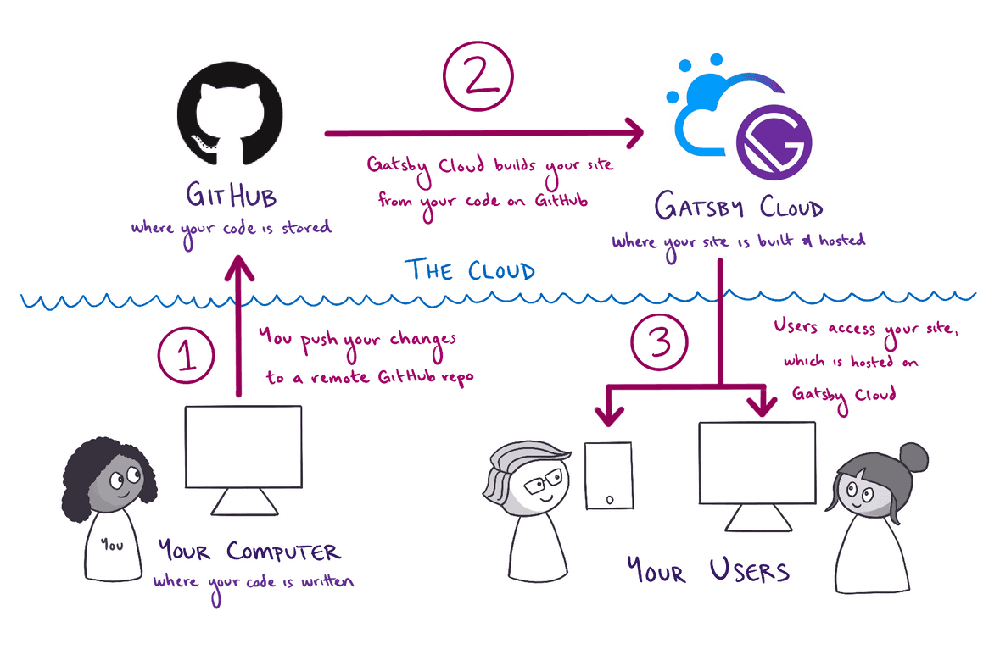

## **What is Gatsby:**

- Gatsby widely known as a Static Site Generator(SSG).
- Use a combination of React and GraphQL.
- Gatsby calls itself a Modern Site Generator.

### **Static Site Generator(SSG):**

Generates static HTML pages using a combo of templates, components and Data.



## **Create and Deploy Gatsby site:**



### **Installation Process Step by Step:**

```
npm install -g gatsby-cli
```

```
gatsby run
```

```
cd folder_name
```

```
npm run develop
```

```javascript
https://localhost/8000

https://localhost/8000/___graphql
```

## **What is GraphQL:**

**GraphQL is a specification for querying data.** `(Specification means that it is some general guidlines on How to query data in a really efficient way)`.

- Gatsby always uses GraphQL to get data.
- Gatsby can call GraphQL APIs directly. But if the data is not in the GraphQL form. Then Gatsby `Plugin` architecture allows us to get non-GraphQL data into Gatsby and then use GraphQL to query it once you have it there.
  So, If our data is in a `CSV`, `markdown`, `any traditional database` or an `CMS`(like wordpress). We can use one of the Gatsby plugin to pull the data into regardless of what format it is in and then once it's in Gatsby, we can use GraphQl the general for querying that data.

### **What does a GraphQL query look like?**

```sql
query MyQuery{     // Main query
    content{       // What to query
        edges{     // Connected items
            node{  // A Single item

                property_1
                property_2
            }
        }
    }
}
```

`Example:`
Common GraphQL query with Gatsby:

```sql
query AllPages{       // Our query
    allSitePage{      // Query All pages
        edges{        //  All the pages
            node{     //  A Page

                id    // Page ID
                path  // Page Slug
            }
        }
    }
}
```

- **GraphQL queries in Gatsby return JSON**
- **GraphQL can filter and sort too.**

### **Where do we put GraphQL queries in Gatsby?**

1. gatsby-node.js
2. Page-templete
3. Any Component
