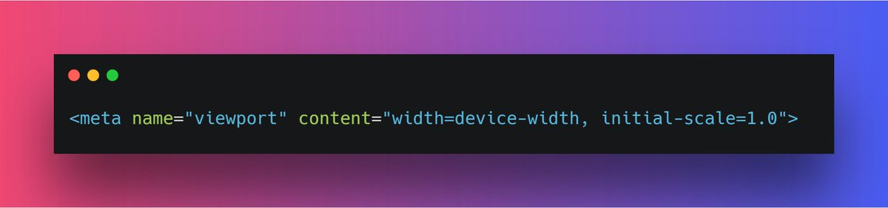
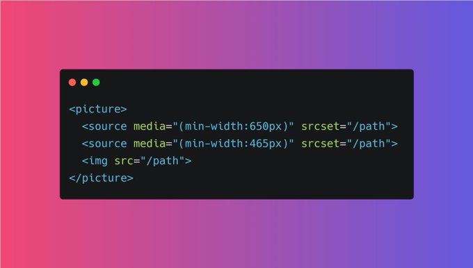
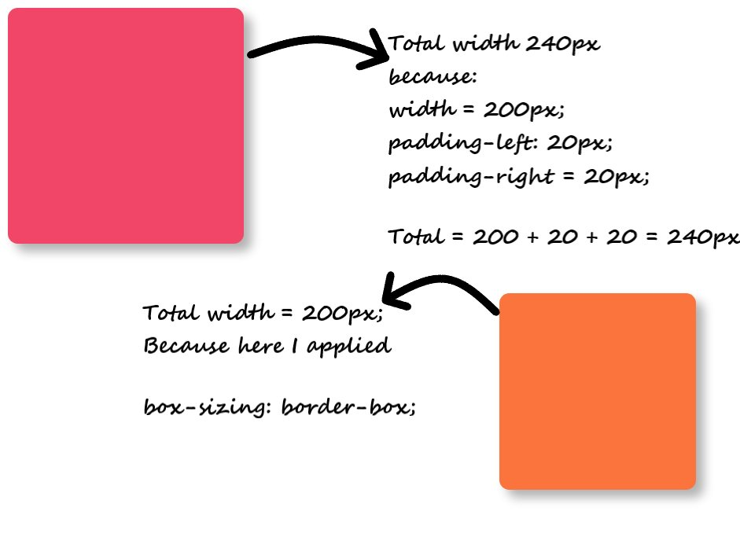
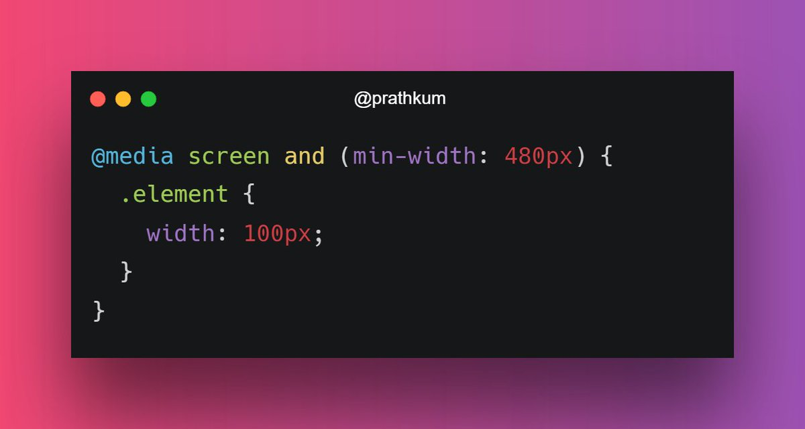
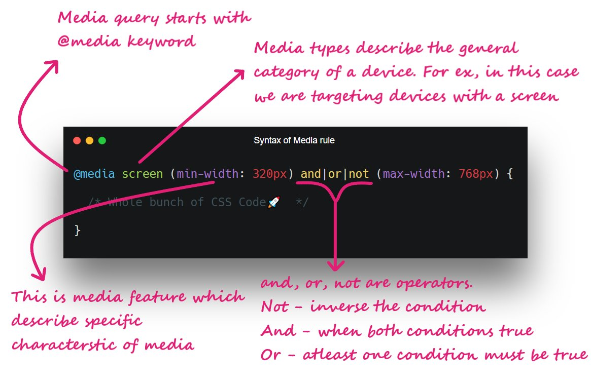

# **Responsive Web Designing:**

Ability of the content to fit inside any device that look good and it will be for user to interact with that.
Responsive designing is just the combination of various concepts by using which we try to make our web page look good on all devices.

1. **viewport meta tag:** First and foremost thing in order to make Responsive Web Design (RWD) is to include `<meta>` viewport element. It forces page to follow the screen-width of the device.
   

2. The second important point to note that don't use large fixed width or height element.
   It can cause trouble. Let's say an element having width 500px but user is viewing on a device having width smaller than 500px. In this case, use min-width or max-width.

3. **Use HTML `<picture>` tag:** The HTML `<picture>` element allows you to define images for different browser window sizes.
   

4. **Responsive Text:** Althrough we can make our text responsive using media queries but we can also use `percentage`, `viewport width (vw)` as well to make them responsive.

   ```css
   For example:
   html{
    font-size: 10px;  <!-- Instead of it -->
   }

   <!-- ---------------------- -->

   For example:
   html{
    10/16 = 0.625 => 0.625 * 100 => 62.5%
    font-size: 62.5%;
   }
   ```

5. **Try to use Layout:** Using Grid or flex always benificial in order to make a web page responsive.
6. **Use box-sizing: border-box:** box-sizing: border-box force an element to adjust it's padding and border inside width and height of that element.
   Because even small border or margin can demage our responsiveness.
   

7. **Media Queries:** Media query is a rule to include a block of CSS properties only if a certain condition is true. It is very useful in order to make a Responsive Web Design.
   
   
   **Breakpoint:** Breakpoint are the viewport width at which we want our design to change.
   Use `em` or `rem` at breakpoint.

   **For Example:**

   ```css
   @media screen and (max-width: 1200px) {
     // code...
   }

   // Instread of this we use em and rem units.
   // In Viewport 16px = 1rem = 1em
   // 1200px/16px = 75em or 75rem.

   @media screen and (max-width: 1200px) {
     // code...
   }
   ```

8. **Use "auto" in media:** Almost 99% of a web pages contains images and videos. And in order to make them responsive, use "auto". If the width property is set a percentage and the height is set to "auto". then the image will be responsive. In order to improve furthur, you can use max-width in image.
