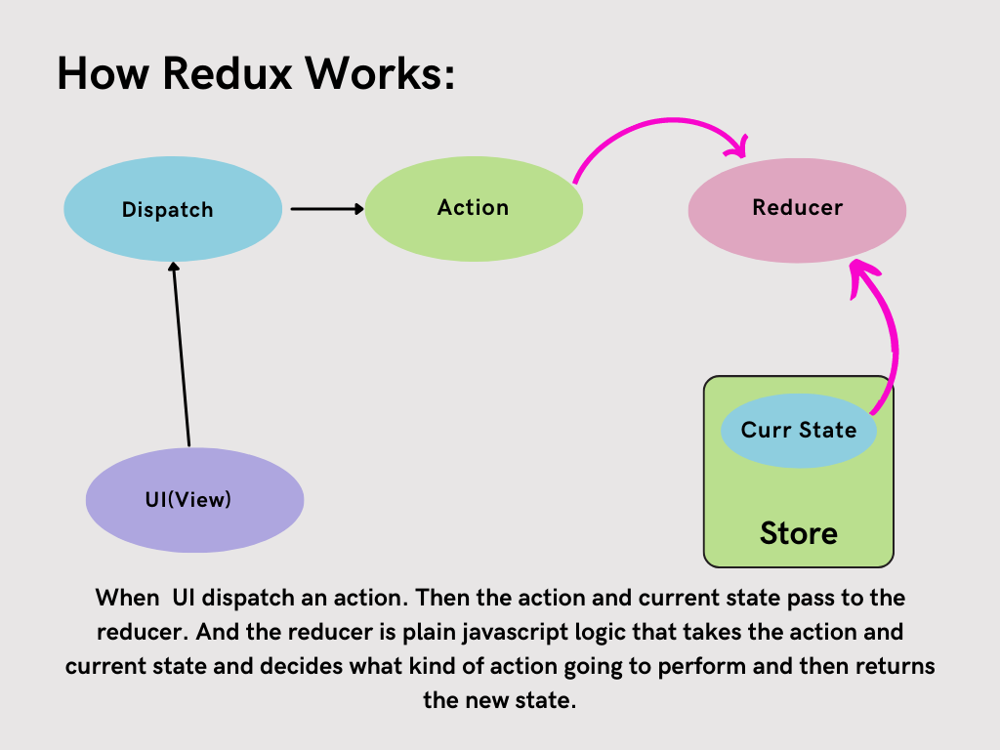
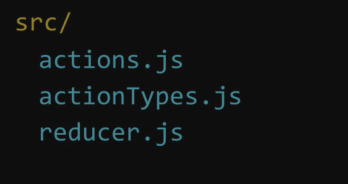
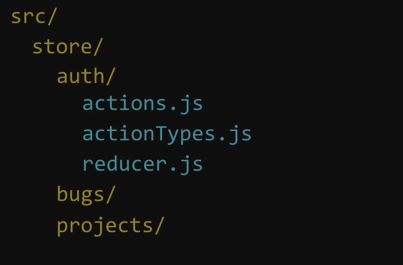
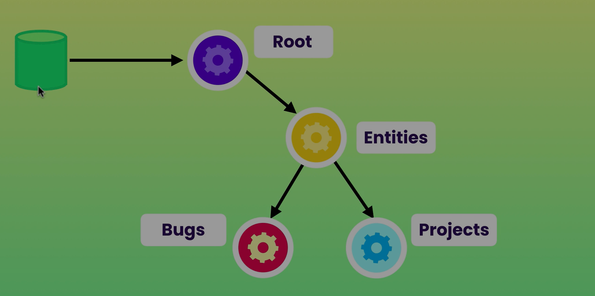
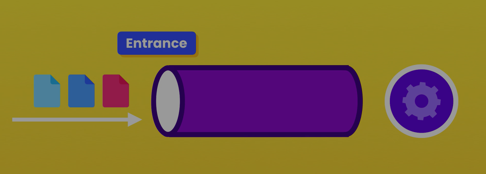
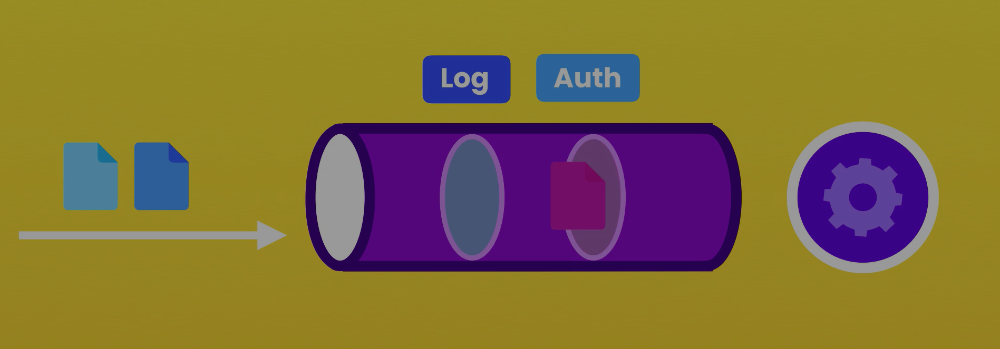
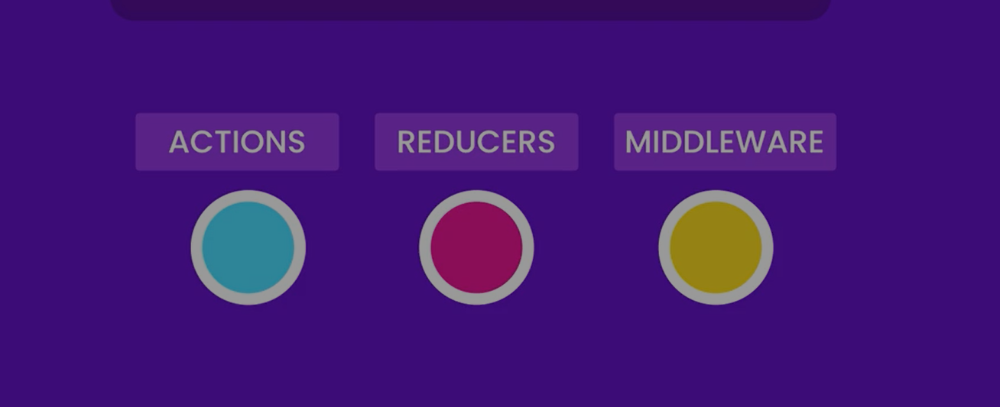

# **Redux:**

Redux is an independent javascript architecture for dealing with the state in predictable way.

Redux is a centralized store for state for the entire apppication.



## **Four steps to create React App:**

1. **Design the Store:** What we want to keep in the store.
2. **Define the Action:** What are the action that user can perform in this application.
3. **Create Reducer:** Reducer is plain javascript logic which takes action and current state and decide what kind of action going to be perform.
4. **Set up the Store:** set up the store according to the application requirement.

## **Writing Clean Code with Redux:**

- First thing for writing clean code that moved your all `redux` code inside a separate folder.
  
- Second thing we want to do for imporving structure of the project is to group file by `feature` folders.
  
  It will break down our application into a bunch of small sub bounded contexts. Each sub domain should have its own action, actionTypes, reducers etc.

The common issue with redux is that everytime we want to support a new action, we have to touch three different files:

- Constant Action types
- Action creators
- Reducers

So, some developer prefer to merge these files into a single file and This is called `DUCKS PATTERN`.

## **Ducks Pattern:**

Duck is essentailly a bundle of actions type, action and reducers for the specific domain.

## **Redux ToolKit:**

### **Creating Store:**

```javascript
import { configureStore } from '@reduxjs/toolkit';

export default function () {
  return configureStore({ reducer });
}
```

### Creating Action:

```javascript
import { createAction } from '@reduxjs/toolkit';
```

```javascript
const action = createAction('Bug Fixing');
console.log(action);
```

We get a function called `Bug Fixing`.
and if we call this function:

```javascript
console.log(action());
```

Then this will return `action` object having two properties:

- type
- payload

And when we call argument to the `action`:

```javascript
console.log(action({ id: 1 }));
```

Then it will return an object with `type: "Bug Fixing"` and `payload: {id: 1}`

### Creating Reducer:

```javascript
import { createReducer } from '@reduxjs/toolkit';
```

`createReducer()` take two argument:

- initial State
- Object: which consist of key value pair. The key is `action` and `value` is a function which handle the actions.

```javascript
createReducer([], {
  bugAdded: (state, action) => {
    bugs.push({
      id: ++lastID,
      description: action.payload.description,
      resolved: false,
    });
  },
  bugResolved: (bugs, action) => {
    const index = bugs.findIndex((bug) => bug.id === action.payload.id);
    state[index].resolved = true;
  },
});
```

### Creating Slice:

Slice create `actions` and `reducer` for us actumatically:

```javascript
import { createSlice } from '@reduxjs/toolkit';
```

```javascript
const slice = createSlice({
  name: 'bug',
  initialState: [],
  reducers: {
    bugAdded: (state, action) => {
      bugs.push({
        id: ++lastID,
        description: action.payload.description,
        resolved: false,
      });
    },
    bugResolved: (bugs, action) => {
      const index = bugs.findIndex((bug) => bug.id === action.payload.id);
      state[index].resolved = true;
    },
  },
});
```

## **Design Redux Store:**

### **Redux State vs Local State**

| Store Global data in redux | Store all data in redux |
| -------------------------- | :---------------------: |
| Esay to Implement          |   Unifies data access   |
|                            |      Cacheability       |
|                            |     Easier to debug     |
|                            |   More testable code    |

**Exception: `Form State`**

- Temprory values
- Too many dispatches
- Harder to debugging

> The more state we put in the store. The more we can get out of redux.

### **Structuring a Redux Store Best Practices:**

Two type of structure:

- Array of object.
- Using Object.

**Object provides fast lookUps, but they don't preserve order**.

**and Array is slow but its provide order.**

> So, If we need for fast lookups, use object.and If we need ordered data, use an array.

If we have multiple slices in the store:

**For Example:**

- bug: [ ]
- project: [ ]
- tags: [ ]

> Then it a good practice to put these slices under the parent slice called `entities`.

> And the another top level slice called `auth` which include the data about the current user such as username, ID, authentication.

> We have another top level slice called `UI` and this is where we can store state specific to certain page or component.

```javascript
{
  entities: {...},
  auth: {userId: 1, name: "Faisal"},
  UI: {
    bugs: {query: "", sortBy: ""}
  }
}
```

### **Combining Reducers:**

Combining reducer multiple reducer, So we can create a store with multiple slices.

`Create a reducer.js File:`

```javascript
import {combineReducers} from redux;
import bugsReducer from './bugs';
import projectReducer from './projects';

3xport default combineReducers({
  bugs: bugsReducer,
  projects: projectReducer,
})
```

Then goto: `store folder`:

```javascript
import reducer from 'reducer';
```

> So by combining these reducer, we are essentially creating a hierarchy of reducer function. At the top, we have the root reducer. and this is the reducer that our store talk to.



If we dispatch an `action` our store passes that action to the root reducer. This root reducer will then pass that action to each child reducer.

### Normalization:

Another important principle to designa `Redux Store` is `Normalzation`. Normalization is basically means that we should not duplicate data in our store.

## **What is Middleware?**

When we dispatching action, you're essentially sending them through a single entry point.



Now on the other side of the entry point, we have our reducer. So, when we dispatch an action, it goes through this pipeline, and reaches it then reaches it to the root reducer.
The root reducer will then pass this action to his child reducers.

Now, in this pipeline, we add function that would get executed an action is dispatched. This is what we call middleware because it sit in the middle.

`So, middleware is the piece if code that gets executed after an action is dispatched, and before it reaches to the root reducer.`



**Middleware:**

- Calling APIs
- Error Reporting
- Analytics
- Authorization

### **How to create middleware function:**

- creating `middleware` folder in the `store` folder.
- create a middleware function inside `middleware` folder: such as `logger.js`.

This fucntion having three parameters:

- **action**: Action is the action that was dispatched.
- **next**: Next reference to the next middleware funciton. If this is the only middleware fucntion we have, next is going to be the reducer that is going to handle this action

```javascript
// curried version of the fucntion...
const logger = store => next => action {
  console.log("Store", store)
  console.log("Next", next)
  console.log("Action", action)
  next(action); //if we don't call next() the action is not going to be processed furthur.
}
export default logger;
```

Now in the configureStore File, the function take the configuration parameter. So in the object, we're specifying our reducer. and now, we can also specify our middleware functions

```javascript
import { configureStore } from '@reduxjs/toolkit';
import logger from '/middleware/logger';

export default function () {
  return configureStore({
    reducer,
    middleware: [logger],
  });
}
```

### **Middleware when not using redux-toolkit:**

```javascript
import { createStore, applyMiddleware } from 'redux';
import reducer from './store/reducer';

const store = createStore(reducer, applyMiddleware(logger));
```

### **Consuming APIs in Redux:**

We are not supposed to call API's in our reducers. Because our reducers should be pure. They should get the current state, and return the new state. Nothing more, no side effect, No APIs, No DOM manipulation, no state mutation.

So, where exactly should we put code with side effect?

In our `actionCreators`.

Traditionally, `actionCreator` return an object, but with the thunk middleware, we can return a fucntion form our action creator. and this function is where we can encapsulate code with side effect.

```javascript
function actionCreator() {
  return function (dispatch, getstate) {
    //side effect code...
  };
}
```

If we don't need to lookup to the state just remove the second parameter and also we can write this function as a arrow function.

```javascript
function actionCreator() {
  return (dispatch) {
    //side effect code...
  };
}
```

**Curried version:**

```javascript
const actionCreator = () => (dispatch) => {
  // Call an API
  //Resolved: dispatch(success)
  //Rejected: dispatch(error)
};
```

But there is a problem with is pattern. The problem is that it become very repetitive. As we implement more features in our application. Everytime we need to talk to the server, we need to follow these three steps, you have to make an API call and handle the resolved and rejected case.

This is where we can use middleware, we can implement the structure with a middleware function.

### **Executing API middleware:**

1. Create a file in the `middleware` folder with the name `api.js`

`api.js` file

```javascript
const action = {
  type: 'apiRequest',
  payload: {
    url: '/bugs',
    method: 'get',
    data: {},
    onSuccess: 'bugReceived',
    onError: 'apiCallFailed'
  }
}
const api = ({dispatch}) => next => async action {
  if(action.type !== 'apiRequest'){
    return next(action);
  }

  // Three steps:
  // 1. API call
  // 2. Handle resolved case
  // 3. Handle rejecte case

  const {url, method, data, onSuccess, onError} = action.payload;

try{
  const response = await axios.request({
    baseURL: 'https://localhost:9001/api',
    url,
    method,
    data,
});
dispatch({type: onSuccess, payload: response.data})
}catch(error){
dispatch({type: onError, payload: error})
}
.then().catch()
}
export default api;
```

2. Add `api.js` file in the `configureStore` file:

```javascript
import { configureStore } from '@reduxjs/toolkit';
import logger from '/middleware/logger';
import api from '/middleware/api';

export default function () {
  return configureStore({
    reducer,
    middleware: [logger],
    api,
  });
}
```

## **Automated Testing:**

Automated testing is about write code to test our code.  
**Types of Tests:**

- Unit test
- Integration test
- End-to-End tests.

### **1. Unit Test**

Unit test involves testing the application without its external dependencies, such as files, database, and web services.

When writing unit tests, we provide mock or fake objects that mimic this external resources.

unit test is super fast.

`API Code ------> Mock API -------> API`

### **Integration test:**

Integration test is a test to to write a bunch of test that test our application along with external resources.

These test are slowe than unit test, but gives us more confident about our application.

### **End-to-End Test:**

End-to-End test involving launching our application and driving it through its user interface. These test gives us the more confidence, but they're also the slowest and the most fragile because a simple change in the application user interface can easily break serveral end to end tests.

## **Setup Testing Envirnoment:**

**Step 1:**
Install all these libraries:
`npm i jest @types/jest @babel/core @babel/preset-env babel-jest -D`

**Step 2:**
Goto the root of the project and create the file with the name: `babel.config.json`.

`babel.config.json` File:

```json
{
  "presets": ["@babel/preset-env"]
}
```

**Step 3:**
Create a file inside `src` folder:
called `math.spec.js`:

> If a file have `spec` in has name its means that it is `test` file.

```json
it("First test:", ()=>{})
```

Then open the `terminal` and type `jest`.

**Step 4:**
Open the `package.json` file:

```json
"scripts":{
  "test":"jest --watch"
}
```

Then write `npm test` in the terminal.

## **Writing our first Unit Test:**

```javascript
it('isEven should return true if given number is even:', () => {
  const result = isEven(2);
  expect(result).toEqual(true);
});

it('isEven should return false id given number is odd:', () => {
  const result = isEven(3);
  expect(result).toEqual(false);
});
```

With `it()` we define a single unit test.

```javascript
describe('isEven', () => {
  it('isEven should return true if given number is even:', () => {
    const result = isEven(2);
    expect(result).toEqual(true);
  });

  it('isEven should return false id given number is odd:', () => {
    const result = isEven(3);
    expect(result).toEqual(false);
  });
});
```

`describe()` is used to bundled multiple test cases.

## **Unit testing with Redux Application:**

1. One way to unit test a redux application is to test its individual building blocks in isolation.



We called these test as `solitary` or `lonely` test. But this is the poor way to test your redux application. **Because it test the implementation of the application not actually the behaviour of the application.**

So to test a Redux application, we should test these building blocks together. We dispatch an action and check the state of the store. And we call these test, Social test.

Test that involves multiple functions or object working together.

**Social Test:**

- Less Fragile
- Cheaper to write
- Cheaper to maintain
- More reliable
